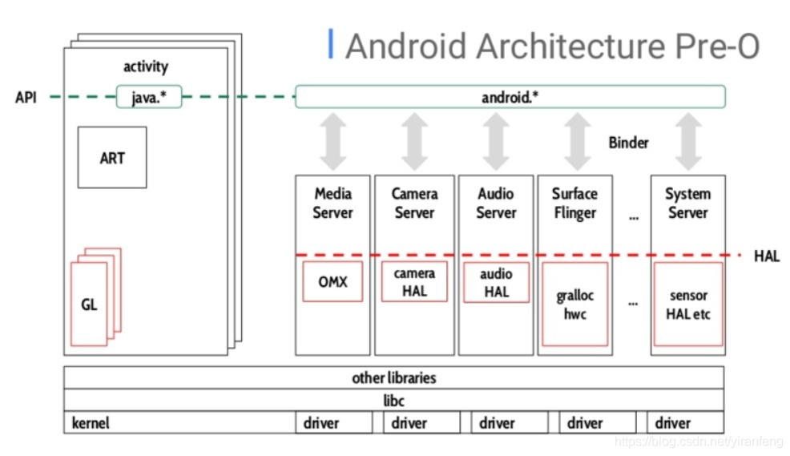
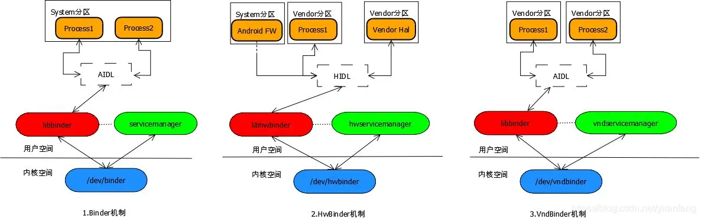
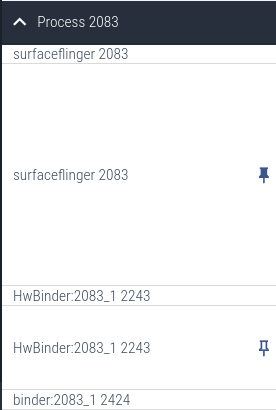

# 简单介绍下binder机制
1. 开始安卓8.0之前只有system分区（framework与hal都打包在system中），hal都是一系列so库，图中可以看出surfaceflinger 与 hal都在一个进程中
  
2. 安卓解耦之后（treble），分成了system分区和vendor分区 （图中可以看出，surfaceflinger与hal通过binder进行通信HIDL），system和vendor分区间无法直接访问，导致原有的binder机制不能继续使用
3. 所以基于上述原因，binder根据不同用途增加了其他两种接口
/dev/binder        框架/应用进程之间的 IPC，使用 AIDL 接口，system/system之间IPC
/dev/hwbinder        框架/供应商进程之间的 IPC，使用 HIDL 接口 供应商进程之间的 IPC，使用 HIDL 接口，system/vendor之间IPC
/dev/vndbinder        供应商/供应商进程之间的 IPC，使用 AIDL 接口，vendor/vendor之间IPC
  
4. 当然，除了上述
目前Android有两种类型的HAL：
1. binder化的HAL，利用hidl来描述HAL接口，framework层与HAL层通过binder IPC的方式进行通信。
2. 直通式HAL：基于hidl或者传统HAL方式实现，在这种模式下，Framework层与HAL层的通信可以通过IPC的方式进行，也可以使用共享内存的方式在同一个进程内进行（passthrough，直通）

# 用例
Android 系统启动完成后，ActivityManager，PackageManager 等各大服务都运行在 system server 进程， app 应用需要使用系统服务都是通过 binder 来完成进程之间的通信。
binder server通过启动线程，实现一个循环查询的操作，不断访问binder driver并读取自己线程的todo list，找到相应的事务并进行相应的处理。

# 具体步骤
进程启动时会创建一个binder线程池，在初始化的时候创建并启动一个主binder线程，其余binder线程由binder驱动来控制创建

## 创建线程池 onZygoteInit
```c
virtual void onZygoteInit()
{
    sp<ProcessState> proc = ProcessState::self();
    ALOGV("App process: starting thread pool.\n");
    proc->startThreadPool();
}
```
## 创建线程
```c
// 一个进程只创建一个binder线程池，并且在初始化的时候创建并启动一个主binder线程，其余binder线程由binder驱动来控制创建
//frameworks/native/libs/binder/ProcessState.cpp
void ProcessState::startThreadPool()
{
    AutoMutex _l(mLock);
    if (!mThreadPoolStarted) {
        mThreadPoolStarted = true;
        spawnPooledThread(true);
    }
}

void ProcessState::spawnPooledThread(bool isMain)
{
    if (mThreadPoolStarted) {
        String8 name = makeBinderThreadName(); 在这创建线程的名字
        ALOGV("Spawning new pooled thread, name=%s\n", name.string());
        sp<Thread> t = new PoolThread(isMain);
        t->run(name.string());
    }
}

String8 ProcessState::makeBinderThreadName() {
    int32_t s = android_atomic_add(1, &mThreadPoolSeq);
    pid_t pid = getpid();
    String8 name;
    name.appendFormat("HwBinder:%d_%X", pid, s); 具体名字格式是进程pid_地日  HwBinder:进程pid_递增的数字
    return name;
}

格式参考
  


```
## 运行线程
    #02 pc 000000000006c8ec  /system/lib64/libbinder.so (android::IPCThreadState::talkWithDriver(bool)
    #03 pc 000000000006cbe0  /system/lib64/libbinder.so (android::IPCThreadState::getAndExecuteCommand
    #04 pc 000000000006d538  /system/lib64/libbinder.so (android::IPCThreadState::joinThreadPool(bool)
    talkWithDriver函数的作用是把IPCThreadState类中的mOut变量保存的数据通过ioctl函数发送到驱动，同时把驱动返回的数据放到类的mIn变量中。

    直观理解上就是与client与server binder通信时候，会创建一个单独的hwbinder线程去处理，clinet同时会等待binder的返回
