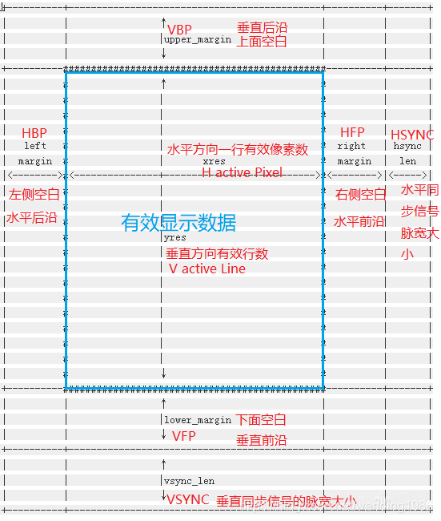
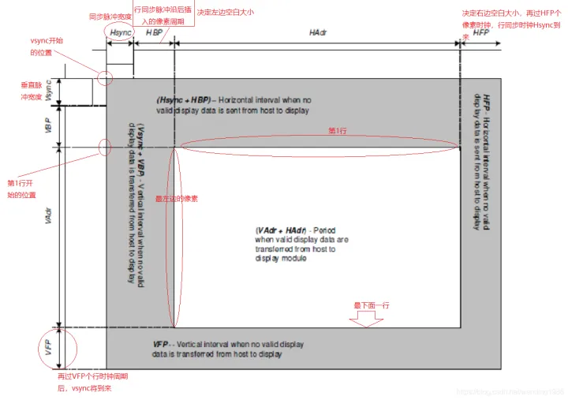
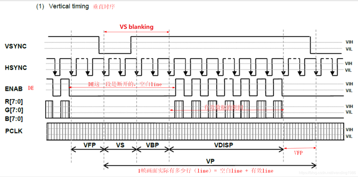
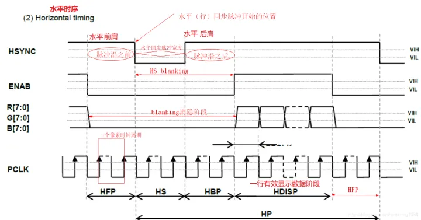
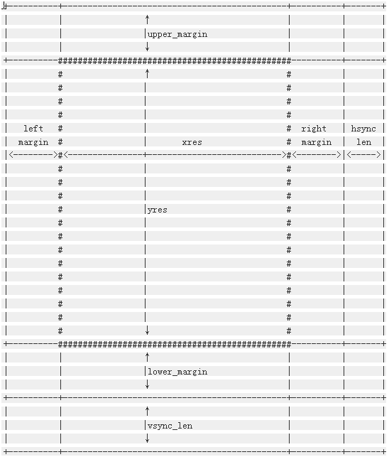

参考：https://zhuanlan.zhihu.com/p/584998091

# LCD timing
关于LCD timing时序参数常见有三种图：Linux对LCD的抽象图、数据手册中的示意图、Timing时序波形图

## 1.Linux对LCD的抽象图：
  

```c
/* include/linux/fb.h */  
struct fb_videomode {  
const char *name; /* optional */  
u32 refresh; /* optional */  
u32 xres;  
u32 yres;  
u32 pixclock;  
u32 left_margin;  /*HBP*/ "在每行象素数据开始输出前，需要要插入的空闲象素时钟周期数"
u32 right_margin;  /*HFP*/ "在每行象素数据结束到LCD行同步时钟脉冲之间，插入的空闲象素时钟数"
u32 upper_margin;  /*VBP*/ "在垂直同步脉冲之后，每帧开头前的无效行数"
u32 lower_margin;  /*VFP*/ "每帧数据输出结束到下一帧垂直同步时钟周期开始前的无效行数"
u32 hsync_len;  /*HSYNC 或 HPW 或 HWH*/ "行同步脉宽，水平同步时钟的脉冲宽度"
u32 vsync_len;  /*VSYNC 或 VPW 或 VWH */ "帧同步脉宽，垂直同步时钟的脉冲宽度"
u32 sync;  "同步极性设置,可根据需要设置FB_SYNC_HOR_HIGH_ACT(水平同步高电平有效)和FB_SYNC_VERT_HIGH_ACT(垂直同步高电平有效)"
u32 vmode;  
u32 flag;  
};  
```
```c
词汇拓展：
"porch" 沿，（大房子屋檐下的）走廊游廊
"margin" 边缘，（版心外的）空白
"HAdr" Horizontal Address 水平地址（空间），实际值对应的就是xres，水平有效像素数
"VAdr" Vertical Address 垂直地址（空间），实际值对应yres，垂直有效行数
"(VAdr + HAdr)" 有效显示数据从主控传输到显示模组上的时期
"blanking" 消隐
"Hblank" 行消隐 实际就是HFP+Hsync+HBP的时间，因为此期间并未有效显示，看做消隐状态
"Vblank" 场消隐 实际就是VFP+Vsync+VBP的时间，因为此期间并未有效显示，看做消隐状态
"HPW" Hsync Pulse Width 水平同步脉冲宽度 = HSYNC = HWH(Hsync Width)
"VPW" Vsync Pulse Width 垂直同步脉冲宽度 = VSYNC = VWH(Vsync Width)
"HS Blanking" Hsync Blanking 水平同步消隐 = HS Pulse Width + HS Back Porch
"Vs Blanking" Vsync Blanking 垂直同步消隐= Vs Pulse Width + VS Back Porch
"One Horizontal Line"= Hs Blanking (thb) + Horizontal Display Area (thd) + HS Front Porch (thfp)
"th = (thb+thd+thfp)" 一行有多少个像素时钟(Pixel)周期
"One Vertical Frame "= Vs Blanking (tvb) + Vertical Dsiplay Area (tvd) + Vs Front Porch (tvfp)
"tv = (tvb+tvd+tvfp)" 一帧有多少个行(Line)周期
"bpp" bit per pixel 每个像素的位数，主控端设置bpp实际是<根据面板每像素位数>来设置<framebuffer的颜色深度>，也即每像素数据需要在framebuffer中占多少bit位。
```

## 2.数据手册中的示意图：
  

概念拓展：
1.Linux对LCD的抽象图是以图像为中心的，而LCD数据手册则以同步信号为中心，参照物不同而已，但内核代码中的left_margin与HBP是说的同一个东西。
2.水平同步信号有时也成为行同步型号，垂直同步信号有人称为场同步信号或帧同步信号
3.Timing时序波形图：
  
  

## 3.时序角度分析显示原理
a.显示从矩形左上角的第一行第一个点开始(Vsync脉冲开始的位置)，一个点一个点的在LCD上显示，在上面的时序图上用时间线表示就为PCLK，我们称之为像素时钟信号；
b.当显示指针一直显示到矩形的右边就结束这一行，那么这一行的动作在上面的时序图中就称之为1 Line；
c.接下来显示指针又回到矩形的左边从第二行开始显示，注意，显示指针在从第一行的右边回到第二行的左边是需要一定的时间的，我们称之为行切换,表示为时序图上的HSYNC。
d.如此类推，显示指针就这样一行一行(Line)的显示至矩形的右下角才把一副图显示完成。
e.然而，LCD的显示并不是对一副图像快速的显示一下，为了持续和稳定的在LCD上显示，就需要切换到另一幅图上,这一副一副的图像就称之为帧(Frame)
f.同样的，在帧与帧切换之间也是需要一定的时间的，我们称之为帧切换，表示为时序图上的VSYNC。

## 4.LCD 常用的计算
1. Pixelclock
Pixelclock（Pclk），也称RGB clk ，单位常用 Mhz
#此处直接使用Pclk，表示Pixelclock频率值
Pclk =(left_margin+xres+right_margin+hsync_len) x(upper_margin+yres+lower_margin+vsync_len)x Refresh
Pclk =(HBP+xres+HFP+HSYNC) x(VBP+yres+VFP+VSYNC)x Refresh
2. Refresh
Refresh = Pixelclock / [(HBP+xres+HFP+HSYNC) x(VBP+yres+VFP+VSYNC)]
3. mipi clk
H-Total-pixel = H-Active-Pixel + HFP + HBP + HSYNC "有版本会包含skew参数,一般为0"
V-Total-line = V-Active-Line  + VFP + VBP + VSYNC 
Pclk = H-Total-pixel * V-Total-line * Refresh
Bitclk = Pclk * bpp /lane_num  "高通bpp设置是byte个数，例3byte，就是3*8=24bit"
Mipi Clk = Bitclk / 2 "根据mipi通讯协议，CLK_N、CLK_P这两根时钟线的上升沿/下降沿均可获取数据，双沿采样，所以要除以2"
Mipi Clk = (Pclk * bpp /lane_num) /2 "知道pclk、bpp、lane_num,也可以计算mipi clk"
Byteclk = bitclk/8
Dsi Pclk = (Byteclk * lane number)/bpp(byte) =  Pclk/8  "待验？"
Byteclk = Pclk * bpp / lane number

Mipiclock = [(width+hsync+hfp+hbp)x(height+vsync+vfp+vbp)] x bus_width x fps / lane_num / 2
"width 水平方向上的有效像素;    height 垂直方向上的有效行;  bus_width 数据总线位宽，即bpp； fps刷新率(帧率)       "
Frame_Bit = (width+hsync+hfp+hbp) x (height+vsync+vfp+vbp) x bpp  "一帧画面的数据量为(单位bit)"
一秒钟内需要传输的数据量为(单位bps)：FRAME_BIT  x  fps（帧率）

4. RGB sync
"假设："
T_Pclk  "表示pclk时钟周期"
T_Hsync "表示hsync时钟周期"
T_Vsync "表示vsync时钟周期"
Pclk  = 1/T_Pclk    "表示pclk时钟频率"
Hsync = 1/T_Hsync   "表示hsync时钟频率"
Vsync = 1/T_Vsync   "表示vsync时钟频率"
"则有："
T_Hsync = H-Total-pixel * T_pclk
T_Vsync = V-Total-line * T_hsync =H-Total-pixel * V-Total-line * T_pclk
"所以："
Pclk =  H-Total-pixel * Hsync
Pclk =  (H-Total-pixel * V-Total-line) * Vsync  "vsync值和Refresh值相等"
Pclk =  (H-Total-pixel * V-Total-line) * Refresh
Hsync = V-Total-line * Vsync    "vsync与hsync的计算关系，对比实际量测信号大小，判断信号正常与否"
Vsync = Pclk / (H-Total-pixel * V-Total-line) "通过pixelclock值和porch参数，计算刷新率refresh"


## S3C2410开发板上的LCD
重要的结构
fb_var_screeninfo
struct fb_var_screeninfo {
  __u32 xres;  /*显存可视区域宽度，单位像素*/
  __u32 yres;   /*显存可视区域高度，单位像素*/
  __u32 xres_virtual;  /*显存的宽度，单位像素*/
  __u32 yres_virtual;  /*显存的高度，单位像素*/
  __u32 xoffset;  /* 显存可视区域左上角x方向偏移*/
  __u32 yoffset;  /* 显存可视区域左上角y方向偏移*/
  __u32 bits_per_pixel;  /* 每个像素在显存中所占的bit数*/

  /* Timing: All values in pixclocks, except pixclock (of course) */
  __u32 pixclock;  /* 像素时钟，单位皮秒，也就是每隔这个时间，控制器向LCD发出一个完整的像素数据*/
  __u32 left_margin;  /*水平前肩，单位(像素时钟个数)time from sync to picture  */
  __u32 right_margin;  /*水平后肩，单位(像素时钟个数)time from picture to sync  */
  __u32 upper_margin;  /* 垂直前肩，单位(像素时钟个数)time from sync to picture */
  __u32 lower_margin;  /*垂直后肩，单位(像素时钟个数)*/
  __u32 hsync_len;  /* 水平同步信号的有效电平的长度，单位(像素时钟个数)length of horizontal sync  */
  __u32 vsync_len;  /*垂直同步信号的有效电平的长度，单位(像素时钟个数) length of vertical sync  */
  __u32 sync;  /* 水平或垂直同步信号的有效电平see FB_SYNC_*  */
  __u32 vmode;  /* 电子枪扫描模式，LCD显然是非交错扫描模式see FB_VMODE_*    */
  __u32 rotate;  /* 显存旋转角度，一般不用angle we rotate counter clockwise */
  __u32 reserved[5];  /* Reserved for future compatibility */
};
Linux对LCD的抽象如下图所示：
  

### 在编写LCD控制器驱动的过程中，需要设置
pixclock
left_margin/right_margin
upper_margin/lower_margin
hsync_len/vsync_len
这些参数都是显示器的数据手册直接或间接给出的，除了pixclock。假如，我要输出60fps的帧率，那么1/pixclock=( left_margin+right_margin+hsync_len+xres)* ( upper_margin+lower_margin+ vsync_len+yres)*60，这样就计算出了pixclock，由于一般向LCD控制器寄存器中写入的是pixclock，而不是帧率，所以，实际的帧率并不一定严格等于60，因为在上面计算过程中pixclock可能会取整。

LCM MIPI 频率的计算和像素频率计算
pixel频率计算和MIPI频率计算，应包含Porch值。比如，对于1024*600的屏来说，加上porch值为Htotal*Vtotal。则：Pixel频率为1344*635*60=51.2MHz, MIPI频率为1344*635*60*24/4=307Mbps，8位，每个R/G/B都是8位，除以4Lane，得到每Lane的速度。对于点灯机，要留Margin，设置成307*1.2=368.4Mbps MIPI频率=Pixel频率*24/4Lane

mipi_pclk按公式带入数据：
(800+10+160+160)*(1280+1+23+12) * 24 * 60 / 4 /2 约等于 268MHz

调lcd timing就是去调lcd时序,一般是6个部分:HFPD(在一行扫描以前需要多少个像素时钟),HBPD(一行扫描结束到下一行扫描开始需要多少个像素时钟),VFPD(一帧开始之前需要多少个行时钟),VBFD(一帧结束到下一帧开始需要多少个行时钟).VSPW(指的是VSYNC处于高电平时的线的数目),HSPW(指的是HSYNC处于高电平时的VCLK的数目),这个可以根据mcu的lcd controller 节时序图上可以得到.如果这个时序不对会导致lcd controller去读写的时候读不到数据或者读写数据错误或者图像左右上线偏移.