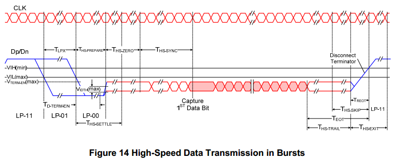

# MIPI DSI协议知识分享

## MIPI接口简介

MIPI(Mobile Industry Processor Interface)是2003年由ARM、Nokia、ST、TI等公司成立的一个联盟，目的是把手机内部的接口如摄像头、显示屏接口、射频/基带接口等标准化，从而减少手机设计的复杂程度增加设计灵活性。MIPI联盟下面有不同的WorkGroup，分别定义了一系列的手机内部接口标准，比如熟知的摄像头接口CSI、显示接口DSI等。
除了MIPI协议，显示屏的接口协议还包括：VGA、HDMI、DVI、LVDS，详细介绍可参考https://www.jianshu.com/p/df46e4b39428

  


## MIPI协议结构分层

  

从下往上依次为物理层、通道管理层、协议层、应用层，四层各司其职。下面先简单介绍下四层的作用，后面再重点讲解这四层的工作原理。
1. 物理层：硬件电路控制，将所有的数据转换为电平信号，以输出或者输入。
2. 通道管理层：对数据进行管理，将数据分给给Data通道或者从Data通道接收到后进行重组，以便交给下一层，由于有多个data lane,发送端数据传输分配在这里进行。
3. 协议层：对数据进行封包、检验等。发送端打包数据,包头包尾错误校验数据等。接受端拆包解析出真正的数据,并对数据完整性进行检查。
4. 应用层：command数据或者图像数据就在这一层发送或者接收。我们使用的显示屏DSI接口应属于应用层。

## 物理层（D-PHY）

### 关于DPHY

MIPI物理层主要包括D-PHY、C-PHY、M-PHY，显示模块使用的是D-PHY协议。
D-PHY：采用的是主从结构，即一个lane通道中同一时刻必须存在一个主设备，一个从设备。一般由一个clock 信号线和一到多个data信号线构成，每根lane都传输差分信号，分为Dp线和Dn线。

```c
差分信号：
差分信号介绍：差分信号分为一正一负，两者之间相位差180度，可以抑制共模干扰，还可以提升信号幅度。
差分信号优点：抗干扰能力强，能有效抑制外部的电磁干扰
```
  

### 传输模式
按照D-PHY协议，在整个协议的物理层中，在主机端和从属端之间采用的是同步连接，时钟通道用于传送高速时钟，一个或多个数据通道用于传送低功耗数据信号或高速数据信号。

  

1. 高速传输模式(Burst Mode)
在高速模式下，输出低摆幅差分信号；当没有数据传输时，data lane处于lp11模式，Dn、Dp都处于高电平状态，当有数据传输时，通过一定的时序进入HS模式，当经过数据传输完毕之后，同样按照一定的时序退出，进入control mode的stop状态。
  
  

2. 低速传输模式(escape mode) ：发低速command常会使用
  

1. 高速模式（Burst Mode）
高速传输(HSDT)进入时序:LP-11, LP-01, LP-00,也称之为SoT(Start-of-Transmission)，相应退出高速的时序为EoT(End-of-Transmission)。
  
  

2. Escape mode
Escape mode 工作于LP mode下，能够进入LPDT(Low-Power Data Transmission 低功耗数据传输模式)。在执行Escape Mode Entry时序后,紧接着要发送Entry Command表明使用哪种功能。
  
 Escape mode 进入时序：LP11→LP10→LP00→LP01→LP00，退出时序：LP10→LP11
3. 控制模式（Control mode）中转状态
MIPI协议规定，将控制模式的4个不同状态组成不同时序，用来代表着将要进入或者退出某种模式。比如LP11-LP01-LP00序列后，进入高速模式。

```c
总结
High-Speed Mode和Escape Mode之间不可以直接来回切换，必须通过Control Mode进行中转，即High-Speed Mode ↔ Control Mode ↔ Escape Mode
如果没有进行高速发数据，lane通常处于LP11状态，也即Control模式种的Stop状态。
两种模式的退出时序：
• Escape mode request (LP-11→LP-10→LP-00→LP-01→LP-00) 
• Escape mode exit (LP-10→LP-11) 
• High-Speed mode exit (T hs-trail -> T hs-exit)  
• High-Speed mode request (LP-11→LP-01→LP-00) 
```

## 应用层

### DSI协议简介
DSI全称Display Serial Interface。顾名思义，该接口是指用于显示模块的一个串行接口，基于MIPI协议而产生，兼容DPI(显示像素接口，Display Pixel Interface)、DBI(显示总线接口，Display Bus Interface)和DCS(显示命令集，Display Command Set)。

  

### 操作模式
DSI支持两种基本的操作模式:command Mode和Video Mode
1. command Mode
Command Mode适用于包含RAM的DDIC模块。一般而言,AP将显示数据发送到DDIC的RAM中,DDIC从RAM中读取数据刷新到屏幕上。
  
2. Video Mode
Video Mode适用于不包含RAM的DDIC模块,需要实时发送数据。
  

### 数据传输
1. 发送packet
DSI 将一次发送动作称为一个Transmission，一个Transmission可以包含多个packet。
每写一个寄存器可以称为一个packet，单个packet发送如下：
  
我们可以将多个packet一起发送,而不用每一个分开发送,以提升效率。合并发送如下:
  
另外，为了提升鲁棒性，DSI又定义了一个EoT Packet，简称EoTp。之前的EoT是从HS mode退出到LP Mode的时序，而EoTp是一个短数据包，接收端在收到EoTp之后即知道发送完成。
2. Packet按照大小分为短包和长包。
短包:Short packets,长度4个字节,包含ECC。短包通常用于发送command。
  
长包:Long packets，多用于传输大块的显示数据或参数很多的命令
长包构成如下:
i  
  

## 通道管理层(Lane Management)
由于有多个data lane，发送端数据传输分配在这里进行。DSI支持多条data lane,在高速传输时数据分布如下:
  
  
高速传输的数据字节数长度是不定的,就存在一个问题,当字节数不能整除data lane数时,数据分布处理如下,以两条data lane举例:
  
## DCS指令集
DSI协议声明支持的标准指令集，用于发送 pixel 数据，配置屏端的一系列功能。
DCS 定义了很多很多的 Command，每个 Command 都有 Command Code，有的 Command 带参数，有的不带，DCS 的 List 如下所示：
  
  
  

1. 39h 进入idle mode（aod mode）38h 退出idle mode（aod mode）
发送这条命令，使得 Display Module 进入 Idle 模式， 明显可以看到，Idle 模式下，色彩信息被减少。
  
2. 21h enter_invert_mode 颜色设置中有一个反转，他的规则就是RGB的三个值，分别与255相减取绝对值：rgb(200, 55, 35)的反转颜色为rgb(55, 200, 220)
3. Sleep In (10h)、Sleep Out (11h)
  