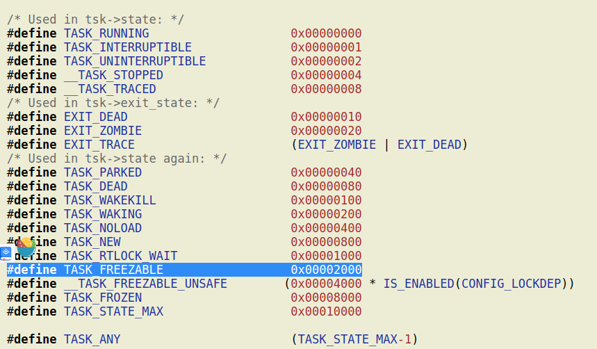
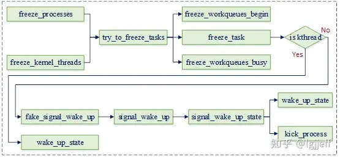

# 进程状态list
  


## 进程冻结介绍

### 含义
进程冻结是指在系统休眠时，挂起系统中的用户进程和部分内核线程，从而使其处于一个确定的状态。
默认情况下用户空间进程是可冻结的，而内核空间进程则是不可冻结的。当然也可以通过设置进程标志，
使某些用户空间进程不可冻结，或使某些内核空间进程可冻结。

### 冻结原因
```c
在系统休眠时，之所以需要冻结进程，主要有以下几个原因：
1. 防止文件系统在休眠后损坏。
	由于hibernate休眠需要创建休眠映像，而每个休眠映像都含有一些与文件系统相关的信息。若在创建休眠映像时，
	其它进程还在修改文件系统的内容，则可能会导致恢复系统时，文件系统的状态不一致。
	由于写文件系统的进程大部分为用户进程，因此除了明确指定不能冻结的之外，用户进程都是可被冻结的。
	而内核线程默认不能冻结，但对于需要写文件系统的线程则也应该冻结它们

2. 对于hibernate休眠，需要为其创建休眠镜像。此时需要为其释放出足够的内存（大约为可用ram的50%）
	因此冻结进程可以防止它们在此期间分配内存而导致休眠失败

3. 防止用户空间进程和某些内核线程干扰设备的挂起和恢复

4. 防止用户空间进程意识到发生了休眠（或挂起）操作。
理想情况下，用户空间进程不应注意到发生了这种系统范围的操作，且应在还原后继续运行。
但若不冻结进程，则很难做到这点，如有的进程运行时需要依赖于所有处于online状态的cpu， 
而在休眠时会禁用secondary cpu。此时如果进程没有冻结，则该进程可能会感知到cpu数量的变化，从而无法工作

综上所述：类似于手术的打麻药 从用户进程的角度来说：是无感知的被冻结

什么是hibernate休眠？
```

### 冻结流程

　　Linux在进程上下文中执行的实体包括用户进程、内核线程和workqueue，因此进程冻结需要分别考虑以上三部分情况。其执行流程分别如下：

  

　　其中<u>freeze_processes</u>用于冻结用户进程，freeze_kernel_threads用于冻结内核线程，它们都通过<u>try_to_freeze_tasks</u>执行实际的冻结操作。其主要原理是通过全局变量控制进程冻结操作，在冻结前设置这些全局变量，然后遍历所有可冻结的进程，分别唤醒相应线程执行实际的冻结操作。被唤醒的线程会根据这些全局变量的值确定是否要执行冻结操作。

内核一共提供了以下三个与进程冻结相关的全局变量：
（1）system_freezing_cnt：表示总的冻结进程数量
（2）pm_nosig_freezing：若其为true表示有内核线程需要冻结
（3）pm_freezing：若其为true表示有用户进程需要冻结

　　如在冻结用户进程前会增加总冻结进程数的计数system_freezing_cnt，并设置表示用户进程冻结相关的变量pm_freezing，其代码如下：

```c
int freeze_processes(void)
{
	…
	current->flags |= PF_SUSPEND_TASK;
	if (!pm_freezing)
		atomic_inc(&system_freezing_cnt);

	pm_wakeup_clear(true);
	pr_info("Freezing user space processes ... ");
	pm_freezing = true;
	error = try_to_freeze_tasks(true);
	…
}
　　而内核线程冻结流程是类似的，其会在执行冻结操作前设置内核线程冻结相关的变量pm_nosig_freezing。当以上变量设置完成后，就可以通过try_to_freeze_tasks遍历进程并对其触发冻结操作，其主要代码如下：


static int try_to_freeze_tasks(bool user_only)
{
	…
	if (!user_only)
		freeze_workqueues_begin();                                （1）

	while (true) {
		todo = 0;
		read_lock(&tasklist_lock);
		for_each_process_thread(g, p) {                    
			if (p == current || !freeze_task(p))               （2）
				continue;

			if (!freezer_should_skip(p))
				todo++;
		}
		read_unlock(&tasklist_lock);

		if (!user_only) {
			wq_busy = freeze_workqueues_busy();                （3）
			todo += wq_busy;
		}
		…
	}
	…
（1）工作队列本质上是通过一组worker_pool线程执行工作队列中的work，因此冻结工作队列需要包含两部分工作。首先冻结后不能再往workqueue中增加新的work，其次本身已插入到workqueue中的可冻结work需要执行完成。本操作主要用于阻止新的work添加到工作队列中

（2）遍历所有进程，并唤醒所有可冻结进程，使其完成冻结操作

（3）等待所有workqueue中可冻结work完成执行操作

　　其中freeze_task的实现如下：

bool freeze_task(struct task_struct *p)
{
	…
	if (freezer_should_skip(p))                                      （1）
		return false;
	…
	if (!freezing(p) || frozen(p)) {                                 （2）
		spin_unlock_irqrestore(&freezer_lock, flags);
		return false;
	}

	if (!(p->flags & PF_KTHREAD))
		fake_signal_wake_up(p);                                  （3）
	else
		wake_up_state(p, TASK_INTERRUPTIBLE);                    （4）
	…	
}
（1）若进程设置了PF_FREEZER_SKIP，则不能冻结

（2）用于判断进程是否需要冻结，其中frozen 函数用于判断当前进程是否已经被冻结，而freezing函数主要通过前面介绍的三个全局变量，判断当前是否处于冻结流程中，其代码如下：

static inline bool freezing(struct task_struct *p)
{
	if (likely(!atomic_read(&system_freezing_cnt)))                      （a）
		return false;
	return freezing_slow_path(p);
}

bool freezing_slow_path(struct task_struct *p)
{
	if (p->flags & (PF_NOFREEZE | PF_SUSPEND_TASK))
		return false;

	if (test_tsk_thread_flag(p, TIF_MEMDIE))
		return false;

	if (pm_nosig_freezing || cgroup_freezing(p))                        （b）
		return true;

	if (pm_freezing && !(p->flags & PF_KTHREAD))                        （c）
		return true;

	return false;
}
　　（a）通过总的冻结进程数判断是否需要冻结
　　（b）pm_nosig_freezing为true说明需要冻结内核线程
　　（c）pm_freezing为true说明需要冻结用户态进程

（3）若需要执行冻结操作，则用户态进程需要通过fake_signal_wake_up唤醒进程执行冻结流程。该流程将在其后详细介绍

（4）内核态线程直接通过wake_up_state唤醒线程执行。当该线程执行时，可通过函数kthread_freezable_should_stop执行冻结流程，它主要通过__refrigerator实现实际的冻结操作。其代码实现如下：

bool kthread_freezable_should_stop(bool *was_frozen)
{
	…
	if (unlikely(freezing(current)))
		frozen = __refrigerator(true);

	if (was_frozen)
		*was_frozen = frozen;
	return kthread_should_stop();
}
　　与内核态线程可直接唤醒执行冻结操作不同，用户态进程则需要在其返回到用户态时才能执行冻结操作。这是因为若其在内核态执行时被冻结，若其正好持有一些锁，则可能会导致死锁。

　　为此，内核通过了一个比较巧妙的方式实现了冻结流程。它首先为该进程设置了一个信号pending标志TIF_SIGPENDING，但并不向该进程发送实际的信号，然后通过ipi唤醒该进程执行。由于ipi会进程内核的中断处理流程，当其处理完成后，会调用ret_to_user函数返回用户态。

　　而该函数会调用信号处理函数检查是否有pending的中断需要处理，由于先前已经设置了信号的pending标志，因此会执行信号处理流程。此时，会发现进程冻结相关的全局变量已设置，故进程将执行冻结流程。以下为其调用关系图：


　　其中try_to_freeze的代码如下：

static inline bool try_to_freeze(void)
{
	if (!(current->flags & PF_NOFREEZE)) 
		debug_check_no_locks_held();
	return try_to_freeze_unsafe();
}
static inline bool try_to_freeze_unsafe(void)
{
	might_sleep();
	if (likely(!freezing(current)))                      （1）
		return false;
	return __refrigerator(false);                        （2）
}
（1）通过进程冻结相关的全局变量，判断当前是否处于进程冻结流程

（2）执行实际的冻结流程

　　进程冻结函数__refrigerator的主要功能就是为进程设置冻结标志，然后通过进程切换流程保存其上下文，并将其切换出去。由于进程被冻结了，因此在解冻之前，其不会再次执行，故将其切换出去之后就完成了冻结流程。以下为其代码实现：

bool __refrigerator(bool check_kthr_stop)
{
	…
	for (;;) {
		set_current_state(TASK_UNINTERRUPTIBLE);
		spin_lock_irq(&freezer_lock);
		current->flags |= PF_FROZEN;                      （1）
		if (!freezing(current) ||
		    (check_kthr_stop && kthread_should_stop()))
			current->flags &= ~PF_FROZEN;
		spin_unlock_irq(&freezer_lock);

		if (!(current->flags & PF_FROZEN))
			break;
		was_frozen = true;
		schedule();                                       （2）
	}
	…
}
（1）设置该进程的冻结标志
（2）将该进程通过schedule函数切换出去
```